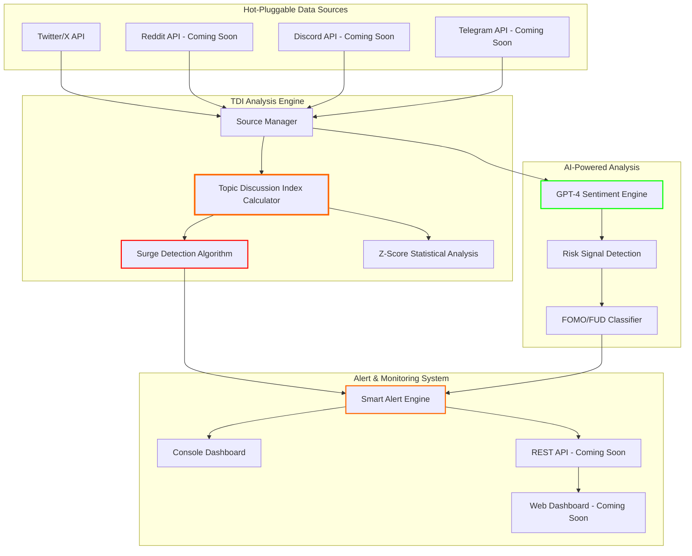

# AlphaRadar - MEME Coin Early Detection System

AlphaRadar is a specialized cryptocurrency sentiment monitoring system focused on **MEME coin early opportunity detection**. Unlike generic crypto sentiment tools, AlphaRadar uses advanced Topic Discussion Index (TDI) analysis and AI-powered sentiment detection to identify emerging MEME coin trends before they explode.

## 🎯 Key Features

### 🔍 **Topic Discussion Index (TDI) Engine**
- **Real-time discussion heat tracking** across multiple platforms
- **Surge detection algorithm** - identifies 50%+ growth in discussion volume  
- **Z-Score analysis** for statistical significance of trends
- **Multi-platform aggregation** with intelligent weighting

### 🧠 **Advanced AI Sentiment Analysis**
- **GPT-powered sentiment engine** trained for MEME coin psychology
- **FOMO/FUD detection** - specialized for crypto trading emotions
- **Risk signal identification** - spots rug pull warnings and scam indicators
- **Confidence scoring** for all sentiment predictions

### 📊 **Hot-Pluggable Data Sources**
- **Twitter/X integration** - tracks hashtags, mentions, engagement metrics
- **Ready for expansion** - Reddit, Discord, Telegram support planned
- **Configurable source weights** - prioritize highest-signal platforms
- **Rate limit management** - enterprise-grade API handling

### 🚨 **Intelligent Alert System**
- **Surge alerts** - coins showing explosive discussion growth
- **Early trend detection** - brewing signals before mainstream notice
- **Risk warnings** - elevated FUD or scam signal detection  
- **FOMO spike alerts** - market-wide fear of missing out detection

## 🚀 Quick Start

### Prerequisites
1. **Twitter API Bearer Token** ([Get it here](https://developer.twitter.com/en/portal/dashboard))
2. **OpenAI API Key** ([Get it here](https://platform.openai.com/api-keys))
3. **Node.js 18+** and npm

### Installation

```bash
# Clone the repository
git clone https://github.com/yourusername/AlphaRadar.git
cd AlphaRadar

# Install dependencies  
npm install

# Set up environment variables
cp env.template .env
# Edit .env with your API keys
```

### Configuration

Edit `.env` file:
```bash
# Required API Keys
TWITTER_API_KEY=your_twitter_bearer_token_here
OPENAI_API_KEY=your_openai_api_key_here

# Optional: Custom tracked coins
TRACKED_COINS=PEPE,WIF,BONK,SHIB,DOGE
```

### Running the System

```bash
# Run the interactive example
npm run meme-radar:example

# Start continuous monitoring 
npm run meme-radar:dev

# Run a single scan
npm run meme-radar:scan
```

## 📈 Understanding the Results

### Topic Discussion Index (TDI)
- **Current TDI**: Real-time discussion heat score
- **Baseline TDI**: Historical average for comparison  
- **Growth Rate**: Percentage increase in discussion volume
- **Z-Score**: Statistical significance (>2.5 = highly unusual)
- **Status**: `silent` → `brewing` → `surging` → `peaked` → `declining`

### Alert Types
- 🚀 **Surge Detected**: Discussion volume exploding (>150% growth)
- 🌱 **New Trend**: Early brewing signals with high confidence  
- 😱 **FOMO Spike**: Market-wide fear of missing out
- ⚠️ **Risk Warning**: Elevated scam/rug pull indicators

### Sentiment Categories
- **extremely_bullish**: Explosive optimism, "to the moon" energy
- **fomo**: Urgent buying pressure, fear of missing out
- **bullish**: Positive outlook, buying interest
- **neutral**: Balanced or informational content
- **bearish**: Negative outlook, selling pressure  
- **fud**: Fear, uncertainty, doubt - deliberate negativity
- **extremely_bearish**: Panic, crash fears

## 🏗️ Architecture



## ⚙️ Advanced Configuration

### TDI Engine Tuning

```typescript
// src/config/meme-radar-config.ts
export const tdiConfig: TDIConfig = {
  currentWindowMinutes: 10,     // Analysis window
  baselineWindowHours: 6,       // Comparison baseline
  
  platformWeights: new Map([
    ['twitter', 1.0],           // Base weight
    ['reddit', 1.2],            // Slightly higher 
    ['discord', 1.5],           // Highest priority
  ]),
  
  engagementWeights: {
    mentions: 2.0,              // New posts (most important)
    likes: 0.5,                 // Like engagement  
    shares: 1.5,                // Viral sharing
    comments: 1.0               // Discussion depth
  },
  
  thresholds: {
    brewingGrowthRate: 0.5,     // 50% = brewing
    surgingGrowthRate: 2.0,     // 200% = surging
    brewingZScore: 1.5,         // Statistical thresholds
    surgingZScore: 2.5
  }
};
```

### Adding New Data Sources

```typescript
// Implement the IDataSource interface
export class RedditSource implements IDataSource {
  name = 'reddit';
  platform = 'reddit';
  isEnabled = true;

  async fetchData(keywords: string[]): Promise<RawDataItem[]> {
    // Your Reddit API implementation
  }
}

// Register with the pipeline
sourceManager.registerSource(new RedditSource(), config);
```

## 📊 Performance & Scaling

- **Data Processing**: ~1000 posts/minute per source
- **API Rate Limits**: Intelligent throttling and retry logic
- **Memory Usage**: ~100MB for 24h of data history
- **Response Time**: <5 seconds for full TDI calculation
- **Scalability**: Horizontal scaling ready with source isolation

## 🛠️ Development

```bash
# Run tests
npm run test:sentiment
npm run test:pipeline

# Development with hot reload
npm run dev

# Build for production
npm run build
```

## 🔮 Roadmap

### Phase 2: Multi-Platform Expansion (Q1 2024)
- Reddit integration (`/r/CryptoMoonShots`, `/r/memecoin`)
- Discord API integration (community servers)
- Telegram channel monitoring
- DEX Screener on-chain data integration

### Phase 3: Advanced Analytics (Q2 2024)  
- Web dashboard with real-time charts
- Historical trend analysis and backtesting
- Machine learning trend prediction models
- Mobile app with push notifications

### Phase 4: Community & API (Q3 2024)
- Public API for developers
- Community alert sharing
- Advanced filtering and custom alerts
- Integration with trading platforms

## 🚨 Disclaimer

This tool is for **informational purposes only**. MEME coin trading is **extremely high risk**. Always:
- Do your own research (DYOR)
- Never invest more than you can afford to lose  
- Be aware of rug pulls and scams
- Understand that past performance ≠ future results

**AlphaRadar helps identify trends, but YOU make trading decisions.**

## 📄 License

MIT License - see [LICENSE](LICENSE) file for details.

## 🤝 Contributing

Contributions welcome! See [CONTRIBUTING.md](CONTRIBUTING.md) for guidelines.

---

**Built for the MEME coin revolution** 🚀 **Track the alpha, ride the wave** 🌊 